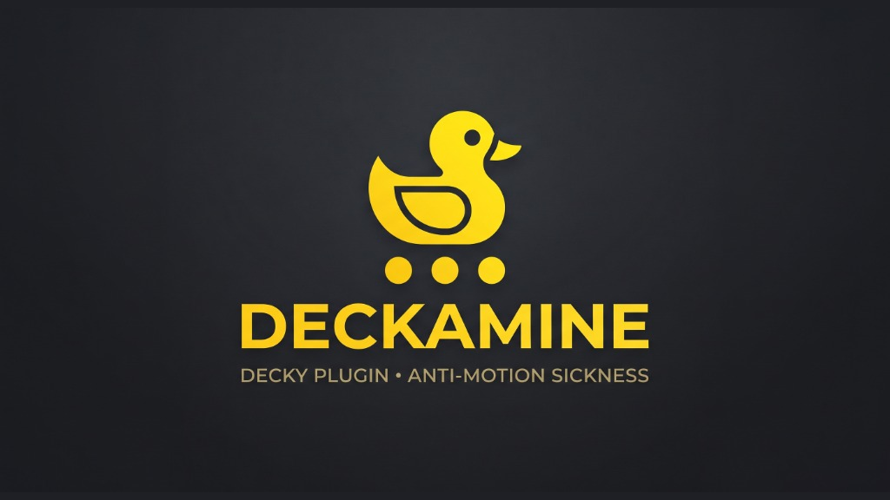

<p align="center">
  
</p>

# Deckamine 🚗💨

**Vehicle Motion Cues for SteamOS / ROG Ally / Handhelds**

[](https://github.com/SteamDeckHomebrew/decky-loader)
[](LICENSE)
[](https://github.com/SteamDeckHomebrew)
[](https://github.com/ElYarim)

**Deckamine** brings Apple-style **Vehicle Motion Cues** to handheld gaming devices running SteamOS / Linux (such as the ASUS ROG Ally, ROG Ally X, and Steam Deck).

By displaying subtle, animated dots along the screen edges that respond to device motion, Deckamine is designed to provide visual motion cues that may help reduce discomfort for some people when gaming in moving cars, trains, buses, or airplanes. It does not guarantee prevention or treatment of motion sickness.

---

## ✨ Features

- **In-Game Overlay Persistence:** Leverages GameScope's composition state pipeline to remain pinned and visible while playing any game, without disappearing when closing the Decky menu.
- **Hardware IMU Integration:** Reads directly from the onboard Linux Industrial I/O (`/sys/bus/iio/devices/`) sensors (such as Bosch BMI323) with a continuous exponential moving average (EMA) filter.
- **Spring-Damper Physics Engine:** Simulates realistic physical inertia at native display refresh rates (60 Hz / 120 Hz) using `requestAnimationFrame`.
- **Zero Impact on Gaming Performance:**
  - Direct imperative DOM transforms.
  - Zero React re-renders during gameplay.
  - No canvas blur memory leaks.
- **Bicolor Dot Design:** Contrasted dots (bright core with dark shadow) ensure clear visibility across dark or bright game backgrounds.
- **Full Customization:**
  - Sensitivity slider (1.0x to 10.0x).
  - Deadzone threshold to filter micro-vibrations.
  - Dot size (8px to 22px) and opacity (30% to 100%).
  - Color presets (White, Neon White, Cyan, Amber, Green).
  - Axis inversion (Invert X / Invert Y).
  - Settings persist across plugin restarts.
  - Calibration reports completion only after sensor samples are collected.
  - Live real-time G-force telemetry monitor.
- **Sensor diagnostics:** Reports when no compatible accelerometer is detected or sensor reads fail.

---

## 🔒 Security & Privacy

Deckamine was designed adhering to the highest security standards:
- **100% Offline:** No network requests, zero telemetry, no external connections.
- **No Input Interception:** Uses `pointer-events: none` on the overlay, guaranteeing all touches, gamepad inputs, and clicks pass directly to the game.
- **Read-Only Hardware Access:** Only reads accelerometer raw files from `/sys/bus/iio/devices/`. No root commands or privileged execution.
- **Safe Codebase:** No `eval()`, no `subprocess`, no dynamic shell execution.

---

## 📦 Installation

### From the Decky Loader Store (Recommended)
1. Open the Decky Loader menu in Game Mode.
2. Go to the **Plugin Store** (shopping bag icon).
3. Search for **Deckamine** and click **Install**.

### Manual Installation
1. Download the latest `deckamine.zip` from the [Releases](https://github.com/ElYarim/deckamine/releases) page.
2. Extract the `deckamine` folder into:
   ```bash
   /home/deck/homebrew/plugins/deckamine
   ```
3. Restart Decky Loader:
   ```bash
   sudo systemctl restart plugin_loader
   ```

---

## 🛠️ Building from Source

### Prerequisites
- Node.js (v18+)
- `pnpm` (v9+)

### Build Steps
```bash
# Clone the repository
git clone https://github.com/ElYarim/deckamine.git
cd deckamine

# Install dependencies
pnpm install

# Run backend tests
pnpm test

# Build frontend bundle
pnpm run build
```
The compiled output will be generated inside the `dist/` directory (`dist/index.js`).

---

## 📄 License

This project is licensed under the [BSD 3-Clause License](LICENSE) by **ElYarim**.
